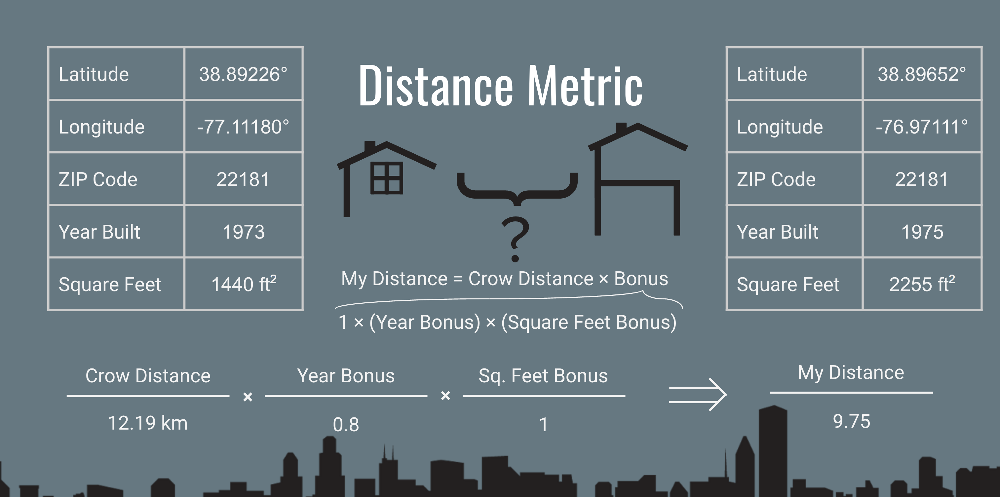

# Reveal Estate

I worked with Denver based company [Privy](http://www.getprivynow.com) on this project. They introduced me to their business model and need for a clustering algorithm.
The goal of this project is to algorithmically group houses into 'nests' of relevant comps. By taking the purely geographically based zones that Privy already made, and finding the patterns that they used, my algorithm can categorize new data. It's even capable of getting data from a totally new city, with different streets and features and create house nests from scratch.

  
<b>Figure 1: </b> Visualization of all houses in dataset. Colored by ZIP Code.    

Check out my web application at [www.reveal-estate.com](www.reveal-estate.com) to learn more!

## Table of Contents
1. [Dataset](#dataset)
2. [Distance Metric](#distance-metric)
3. [Scoring Function](#scoring-function)
4. [Agglomerative Clustering](#clustering)
    * [Privy Zones](#1-privy-zones)
    * [My Zones (Distance)](#2-my-zones-physical-distance)
    * [My Zones (Other Features Included)](#3-my-zones-other-features-included)  
5. [Results](#results)

## Dataset

The data was collected by Privy from multiple listing services (MLS) online. The organization of this data is a big part of the service that they provide. I took their data from the greater DC/Northern Virginia/Maryland area that was already classified manually. After removing points with missing data, there were about 250,000 homes in the data. My goal was to emulate the geographic clusters, and make them even more homogenous by bringing in more features from the MLS dataset.

## Distance Metric

The first thing I needed for the project once I had clean data was a distnace metric to quantify how 'far apart' two houses in the data are. At it's simplest level, this is just the distance 'as the crow flies.' As I added more MLS features to the data, the new distance metric could reward and penalize houses for similar and different features.
This quantity was used in two different places in the project.

* Score clusters that have been made. See [Scoring Function](#scoring-function).
* Create new clusters. See [Agglomerative Clustering](#clustering).

  
<b>Figure 2: </b> Simplified example of custom 'distance' metric used in clustering    

## Scoring Function

I made a cluster evaluation metric to asses the quality of a given set of clusters. A [Silhouette Score](http://scikit-learn.org/stable/modules/generated/sklearn.metrics.silhouette_score.html) rewards houses that have a small mean distance to other houses in their cluster. It also rewards houses with a large mean distance to other cluster centers.

## Clustering

The first thing my model does is segments the data into all the different ZIP Codes represented. A distance between two houses only exists is they are in the same zip code.
My hierarchical clustering algorithm starts by taking the two 'closest' houses in a ZIP Code and aggregating them into the same cluster. It dose this again and again until there are the same number of clusters in a given Zip Code as Privy started with.

Once my model was tuned and had classified the houses, I had three sets of clusters over the same data to compare.

### 1. Privy zones

The previously established manually clustered zones that Privy drew are the baseline model. I first optimized the distance and scoring functions to preform very well on these clusters. This project really boils down to algorithmically replicating these zones, and even going a step further to make them more homogeneous.

* Pros
    * Proven to work well in the real world
    * Easily interpretable
    * No cluster overlap
    * Balanced clusters

* Cons
    * Takes an extremely long time to manually draw zones
    * Okay [silhouette score](#scoring-function)

  
<b>Figure 3: </b> Privy clusters in ZIP Code 20120    

### 2. My Zones (Physical Distance)

My first attempt at replicating Privy's zones was simply to cluster using a physical distance metric. This replicated the Privy zones reasonably well and even preformed a little bit better according the average zone silhouette score.

* Pros
    * Fast algorithmic solution
    * Easily interpretable
    * No cluster overlap

* Cons
    * Cluster imbalance

  
<b>Figure 4: </b> Distance based clusters in ZIP Code 20120   

### 3. My Zones (Other Features Included)

The final, implementable model that I made takes into account other important features in the dataset alongside the latitude/longitude data. My algorithm can categorize over a half million houses per hour, making it considerable more efficient than manually labeling each cluster.

* Pros
    * Strongest [silhouette score](#scoring-function)
    * Fast algorithmic solution

* Cons
    * Takes an extremely long time to manually draw zones
    * Not as easily interpretable
    * Some cluster overlap

  
<b>Figure 5: </b> Final model clusters in ZIP Code 20120   

## Results

After training my model scoring system to preform very well with the pre-labeled zones from Privy, I let the agglomerative clustering algorithm loose on the data. I ended up with clusters that somewhat emulated the geographically clustered houses from Privy. My clusters overlapped somewhat, to combine houses that are a little further apart that have features in common with other houses in their new cluster.
The pictures show the differences in my clusters vs. those from Privy in a suburban setting and an urban one.
